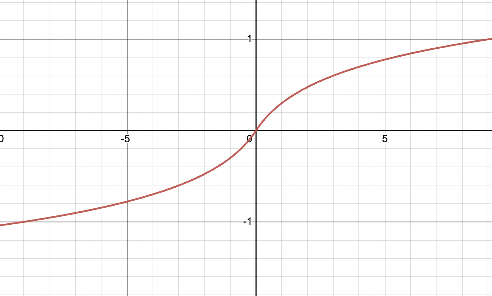

# gru-valuation

This project uses a PyTorch GRU-based recurrent neural network that, given a company's financials over a period of years, outputs a prediction of the company's market cap.

## Usage

First, we need to convert our data from a CSV to a SQLite database (I recommend that you read "Data Sourcing" first):

    python3 load_fundamentals.py

Once this process has finished, our data is converted and ready to be used for training. To begin training, run:

    python3 train.py --hidden-size 256 --batch-size 64 --log-interval 10 --optimizer SGD --lr 0.01

where the (hopefully) self-evident arguments are to your liking. After this process has ran for a while, you should have a log of training in the form of time, average loss for the interval, the standard deviation of the loss, and training speed:

    16:49:05 |  2.9140363 |  443.67615 |       17.1
    16:49:15 |  1.4571508 |  51.908774 |       16.3
    16:49:25 |  1.2931674 |    52.4245 |       16.6
    16:49:35 |   1.289802 |  54.973232 |       16.9
    16:49:45 |  1.3176155 |  94.471841 |       16.4

at which point you can try to run a prediction on a company (Bank of America, ticker BAC, in this case):

    python3 predict.py BAC --hidden-size 256

This will spit out a list of predicted market caps for each time step of input that the model was given.

Also, model and optimizer states are saved, so it should be possible to resume training whenever.

## Architecture

The model uses a three layer architecture that is very much conventional in terms of RNNs:

1. First, an input layer takes a pre-processed (discussed in a moment) selection of a company's financial data across some number of years.
2. Then, a gated recurrent unit (GRU) layer is used to permit the network to "remember" as we feed it data for multiple years.
3. Finally, the outputs of the GRU are summed and weighted (ie. a fully-connected linear layer with a single node) to produce the output of the network.

## Pre-Processing and Scaling

As financial data often exists in large numbers, the need to perform pre- and post-processing steps to scale values up or down arises. After all, feeding millions and billions into a tanh would saturate the function, creating a network that doesn't learn. Thus, we'll need to squish our inputs down in a way that prevents numerical instabilities from affecting the performance of our network.

While I originally hoped to simply take the logarithm of inputs, it immediately became obvious that such a solution wouldn't work; log is undefined for negative numbers! Ideally, we would scale positive numbers down to zero in a (roughly) exponential nature, and scale negative numbers up to zero, again in a (roughly) exponential nature. So, that's what I did:

    def scale_down(x: torch.Tensor):
        return (x.abs() + 1).log() * x.sign()
    
This function, in essence:

1. makes the log function defined for negatives (the `x.abs()`);
2. makes the log function pass through the origin (at (0, 0)) (the `+ 1`);
3. accounts for the sign of the input (the `* x.sign()`).

When graphed, this function looks like a horizontally-stretched "S" shape, and is defined for all real numbers:

Also, the inverse of this function (`scale_up`) is used to scale up the outputs of the network.

## Data Sourcing

Good quality historical financial data is hard to find. So far, the most complete and reasonably priced dataset I've encountered is the [Sharadar Core US Fundamentals](https://data.nasdaq.com/databases/SF1/data) on Nasdaq Data Link. It provides a litany of metrics for the past 20-ish years across 16,000 companies.

While using data from any source should be possible, I've written an "importer" for the Sharadar database. This takes the CSV from Nasdaq Data Link, and moves it to a SQLite database for easier storage and retrieval.

## Inputs

Currently, the model takes revenue, EBIT, net income, operating cash flow, free cash flow, assets and liabilities as inputs. While these are somewhat arbitrary choices, I reckon that they're enough to establish a somewhat reasonable valuation of a company. If you think otherwise, feel free to change them by modifying the `COLUMNS` list.